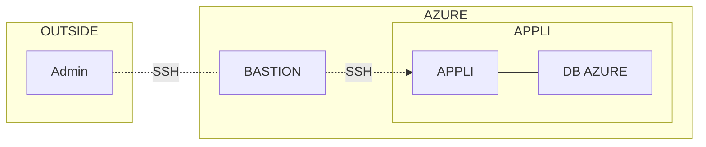

$$ classDef [nom of groupe 1] fill:#faa,stroke:#f66,stroke-width:4px,color:#fff,stroke-dasharray: 5 5;
$$ class [nom d'object à colorer], [nom d'object à colorer];
$$ classDef [nom de groupe 2] fill:#aff,stroke:#025,stroke-width:2px,color:#003;
$$ class [nom d'object à colorer], [nom d'object à colorer];