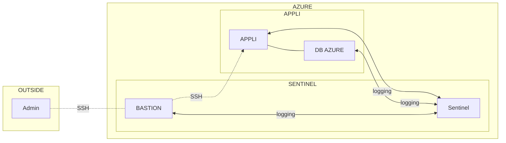

```mermaid
flowchart LR
subgraph OUTSIDE
A[Admin]
end
A -. SSH-..- B
subgraph AZURE
    B[BASTION]
    B-.SSH-..->C
    C---D
    subgraph APPLI
    C[APPLI]
    D[DB AZURE]
    end
    subgraph SENTINEL
        E[Sentinel]
        C <-- logging --->E
        D <-- logging --->E
        B <-- logging --->E
    end
end
```