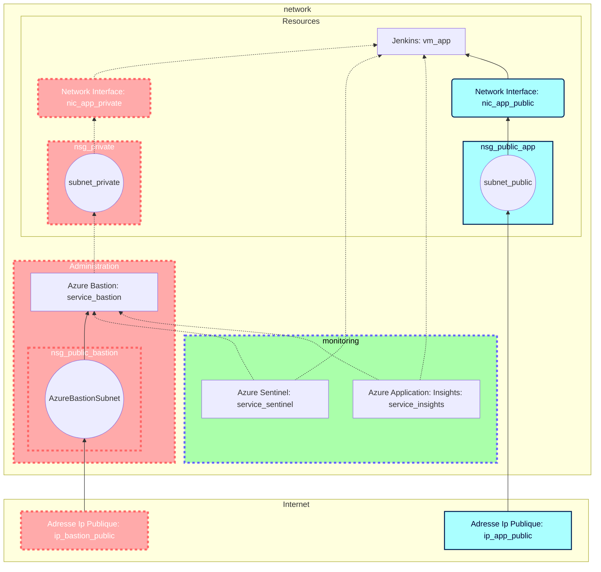

# Brief 3

[toc]

Réalisé par : Alain, Noa, Paul et Quentin

## 1 Plan d'action.

### 1.1 Topologie de l'infrastructure.

### 1.2 Liste des ressources.

ICI NOA TRAVAILLE PAS TOUCHE

| Nom | Type | Description | Annotation |
| -------- | -------- | -------- | - |
|   BRIEF_3  | Resource group |      | |
| vnet_3     | Virtual Network | Réseau virtuel | Réseau virtuel contenant toute l'infrastructure |
| AzureBastionSubnet | Virtual Network | Sous-réseau du bastion    | Réseau virtuel réservé au bastion |
| PrivateSubnet     | Virtual Network     |      | Contient l'application |
| AppSubnet  | Virtual Network    | pour la connection HTTP des utilisateurs     |  |
| public_ip_app | Public IP address |  |IP Publique permettant l'accès depuis le navigatteur en HTTPS |
| public_ip_bas | Public IP address |  | IP Publique du bastion|
| nsg_public_bas     | Network Security Group   |      | |
| nsg_private    | Network Security Group     |      | |
| nsg_public_app     | Network Security Group     |      | |
| nic_app_public    | Network Interface  |      |  |
| nic_app_private    | Network Interface  |      | Permet la communication en SSH |
| vm_appli | Virtual Machine | VM contenant l'application Jenkins |
| Sentinel | Azure Sentinel| |
| Insight | Azure Insight | |

### 1.3 Liste des tâches.
- [ ] Planifier les actions et quelles ressources mettre en place.

    - [x] Créer la topologie de l'infrastructure.
    - [ ] Lister les ressources.
    - [ ] Lister les tâches.
    - [ ] Assigner les tâches.
    - [ ] Créer la synthèse d'utilisation
    - [x] Quel langage utiliser pour le scripting ? --> **Python**

[Lien vers doc Microsoft pour déployer Bastion](https://docs.microsoft.com/en-us/azure/bastion/create-host-cli)
Penser au --help :

[Doc commande créa / chargement ssh](https://docs.microsoft.com/fr-fr/azure/virtual-machines/ssh-keys-azure-cli)
